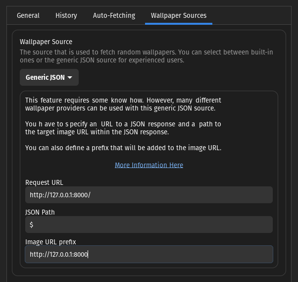

# `random-wall`: Random wallpaper provider

> This software is designed to work with the GNOME extensions Random Wallpaper and is probably not ideal for other scenarios and **none other scenarios are intended to be supported**

`random-wall` is a simple web server built with Rust that enables anyone to easily use the "Custom JSON" source option for the [Random Wallpaper](https://extensions.gnome.org/extension/1040/random-wallpaper/) GNOME extension to serve wallpapers randomly from a folder containing them. This is a practical and simple solution to a [long wanted feature](https://github.com/ifl0w/RandomWallpaperGnome3/issues/30) in the extension itself.

## Installation

The program locates the folder to use to pick the wallpapers using the environment variable `WALLPAPER_FOLDER` (**IMPORTANT: path should be absolute**, there is no kind of path resolution built in), so be sure to have it well defined (in the following sections it is described how to properly set it).

The software is built with the [Rocket Framework](https://rocket.rs/) so you can customize any of the framework settings following [their documentation on it](https://rocket.rs/v0.5-rc/guide/configuration/#overview) (for example, the port or keep_alive configuration).

### Binary

You can get the `random-wall` executable from either of this sources:

- This repo releases page

- From [crates.io] with `cargo install random-wall` (requires a valid Rust installation)

- By cloning the repo and building from source (Rust version used is `stable 1.66.1`)

You can easily test the installation locally by going to where the binary lays (or if you installed with cargo, it should be in your `$PATH`) and running:

```bash
$ WALLPAPER_FOLDER=$HOME/wallpapers ./random-wall
```

Access `http://127.0.0.1:8000/` and it should give you a path as a JSON string in a form similar to `"/w/<WALLPAPER_FOLDER_ABSOLUTE_PATH>/<some_wallpaper_image>"`. If you now put that after the base URL, you will get the corresponding image. How to ensure that the software is running is now your job, here is an example using the package `daemonize` to quickly create a daemon for it:

```bash
# If you downloaded the release, running the terminal where you have the file
$ daemonize -E WALLPAPER_FOLDER=$HOME/wallpapers -E ROCKET_PORT=9697 -v $(pwd)/random-wall

# If you used cargo install
$ daemonize -E WALLPAPER_FOLDER=$HOME/wallpapers -E ROCKET_PORT=9697 -v $(which random-wall)

# If you built from source, being in the project root
$ daemonize -E WALLPAPER_FOLDER=$HOME/wallpapers -E ROCKET_PORT=9697 -v $(pwd)/target/release/random-wall
```

### Via Docker

> _It is coming..._

## Usage

To configure it with the [Random Wallpaper for GNOME extensions](https://extensions.gnome.org/extension/1040/random-wallpaper/), after of course you get it installed, open the extension settings and you can set it up to use the _Generic JSON_ configuration like the following:



These are the values you should put:

- Request URL: `http://127.0.0.1:<port>/`

- JSON Path: `$` (that represents the root element)

- Image URL Prefix: `http://127.0.0.1:<port>` (prepend the URL where you have deployed to the path the random call returns)

This is an example configuration for running it locally, but of course you can run it on a server or wherever and replace the _Request URL_ with it.
